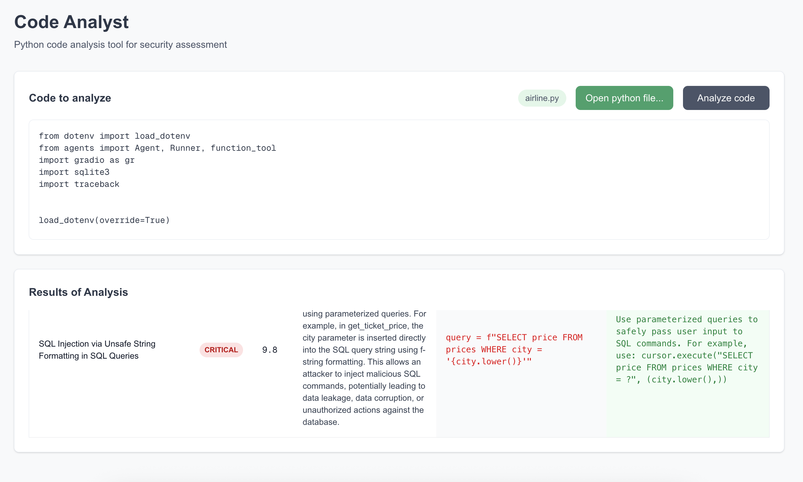

# Code Analyzer Agent

**Code Analyzer Agent** is an AI-powered web application designed to analyze Python code for security vulnerabilities and quality issues. It combines advanced AI models with static analysis tools to provide actionable insights for developers, enhancing code security and maintainability.



## Features

- **Intelligent Code Analysis**: Leverages OpenAI's latest models for contextual understanding of Python code.

- **Static Security Scanning**: Uses Semgrep to detect security vulnerabilities and coding issues.

- **Modern UI**: Built with React and Next.js for a responsive, user-friendly interface.

- **Fast Backend**: Powered by FastAPI for efficient API handling.

- **Containerized Deployment**: Uses Docker for consistent environments.

- **Cloud Infrastructure**: Deployable with Terraform for scalable cloud setups.

- **Customizable**: Easily extensible for additional analysis rules or integrations.

---

## Tech Stack

- **Frontend**: Next.js, React, Tailwind CSS

- **Backend**: FastAPI (Python)

- **AI Analysis**: OpenAI API

- **Static Analysis**: Semgrep

- **Containerization**: Docker

- **Infrastructure**: Terraform

- **Fonts**: Inter, JetBrains Mono

- **Other Tools**: PostCSS, TypeScript

---

## Setup

### Local Development
1. **Clone the Repository**:
   ```bash
   git clone https://github.com/BenGJ10/Code-Analyzer-Agent.git
   cd code-analyzer-agent
   ```

2. **Frontend Setup**:
   - Navigate to the frontend directory:
     ```bash
     cd frontend
     ```
   - Install dependencies:
     ```bash
     npm install
     ```
   - Create a `.env.local` file in `frontend/` with:
     ```env
     NEXT_PUBLIC_API_URL=http://localhost:8000
     ```
   - Start the development server:
     ```bash
     npm run dev
     ```

3. **Backend Setup**:
   - Navigate to the backend directory:
     ```bash
     cd backend
     ```
   - Create a virtual environment and install dependencies:
     ```bash
     python -m venv venv
     source venv/bin/activate  # On Windows: venv\Scripts\activate
     pip install -r requirements.txt
     ```
   - Create a `.env` file in `backend/` with:
     ```env
     OPENAI_API_KEY=your-openai-api-key
     ```
   - Start the FastAPI server:
     ```bash
     uvicorn main:app --host 0.0.0.0 --port 8000
     ```

4. **Semgrep Setup**:
   - Install Semgrep:
     ```bash
     pip install semgrep
     ```
   - Configure Semgrep rules in `backend/semgrep-rules/` (if applicable).

5. **Access the Application**:
   - Open `http://localhost:3000` in your browser.

---

## Usage
1. **Upload Python Code**:
   - On the web interface, click "Open Python File" to upload a `.py` file.
   - The code will be displayed in the textarea.

2. **Analyze Code**:
   - Click "Analyze Code" to run the analysis.
   - View the results, including a summary and detailed security issues (with severity, CVSS score, description, vulnerable code, and recommended fixes).

3. **Interpret Results**:
   - Issues are categorized by severity (Critical, High, Medium, Low).
   - Use the provided fixes to address vulnerabilities.

---

## Azure Deployment (Terraform)

The project supports end-to-end Azure deployment using the Terraform config in terraform/azure.

### Provisioned Resources

- **Azure Container Registry (ACR)** – stores Docker images

- **Azure Container Apps Environment** – managed hosting

- **Azure Container App** – runs the container via HTTPS

- **Log Analytics Workspace** – collects logs and metrics

---

## License
This project is licensed under the MIT License. See the [LICENSE](LICENSE) file for details.

---